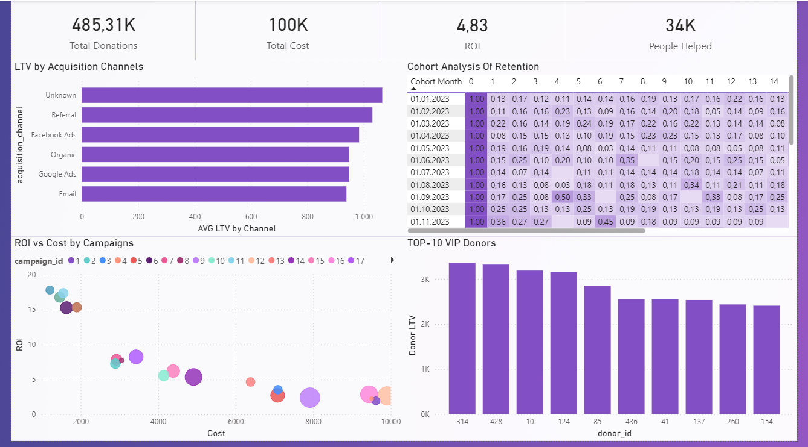

# NGO Donor Analytics: Retention & Campaign Performance

## Project Overview

This project analyzes donor behavior, campaign efficiency, and fundraising performance for a non-profit organization.

The goal was not only to build a dashboard, but to identify the main drivers of sustainable fundraising growth and answer real business questions related to retention, acquisition quality, and ROI optimization.

The analysis was built around a complete analytical workflow:
- raw data preparation
- exploratory analysis
- cohort retention analysis
- donor segmentation
- campaign efficiency evaluation
- A/B testing simulation
- interactive BI dashboard development
---

## Key Business Questions

1. Which acquisition channels bring the highest-value donors?
2. What is the donor retention rate over time?
3. Which campaigns generate the best ROI?
4. How efficiently are donations converted into social impact?
5. Who are the most valuable donors?

---

## Tech Stack

### Python
- pandas
- numpy
- matplotlib
- statsmodels

### BI & Visualization
- Power BI
- DAX
- Star schema data modeling

---

## Data Pipeline

### 1. Raw Data Collection
The project uses four independent datasets:

- donations
- donors
- campaigns
- impact

---

### 2. Data Cleaning & Validation
Performed in Python:
- missing value handling
- datatype correction
- duplicate validation
- feature engineering
- cohort preparation

---

### 3. Analytical Processing
Created:
- retention cohorts
- LTV calculations
- ROI metrics
- donor segmentation
- impact efficiency indicators
- A/B test simulation

---

### 4. Dashboard Development
Built a Power BI dashboard using:
- star schema modeling
- calculated columns
- DAX measures
- cohort heatmaps
- KPI cards
- interactive filtering

---

## Key Insights

### Retention is the main growth problem
More than 85% of donors do not return after their first donation.

The organization depends heavily on one-time contributions, creating unstable and unpredictable revenue streams.

---

### Google Ads brings the highest-quality donors
Google Ads generates donors with the strongest LTV metrics, despite relatively low acquisition volume.

Facebook Ads produces higher traffic but lower donor quality.

---

### Revenue is concentrated among a small donor segment
A small group of donors generates a disproportionately large share of total revenue.

High-value donors:
- donate more frequently
- have significantly higher lifetime value
- are mostly acquired organically or through referrals

---

### Campaign efficiency varies significantly
Food campaigns provide the most stable ROI.

Education campaigns achieve the highest peak ROI performance.

Emergency campaigns operate with substantially lower efficiency.

---

### Several campaigns show poor impact efficiency
Most campaigns maintain low cost per person helped.

However, specific outliers demonstrate extremely high operational costs with weak social impact.

---

### Retention strategies show strong upside potential
A simulated A/B test demonstrated a 145% increase in repeat donation rate after introducing retention-focused engagement mechanics.

The strongest uplift appeared among mid- and high-value donors.

---

## Dashboard Preview

The dashboard was designed to provide both executive-level KPIs and operational-level insights.

Main components:
- Total Donations
- ROI
- People Helped
- Retention Rate
- LTV by Acquisition Channel
- Cohort Retention Matrix
- ROI vs Cost Analysis
- Top High-Value Donors



---

## Project Structure

```bash
ngo-donor-analytics/
├── data/
├── notebook/
├── dashboard/
├── presentation/
├── screenshots/
├── README.md
```

---

## Deliverables

- Cleaned analytical datasets
- Exploratory analysis notebook
- Cohort retention analysis
- Donor segmentation analysis
- Campaign ROI evaluation
- A/B testing simulation
- Interactive Power BI dashboard
- Business recommendations

---

## Key Takeaways

This project demonstrates:
- end-to-end analytical workflow
- ability to work with raw and imperfect data
- business-oriented analytical thinking
- practical application of retention and cohort analysis
- dashboard development and DAX modeling skills
- ability to translate analytical findings into actionable business recommendations
